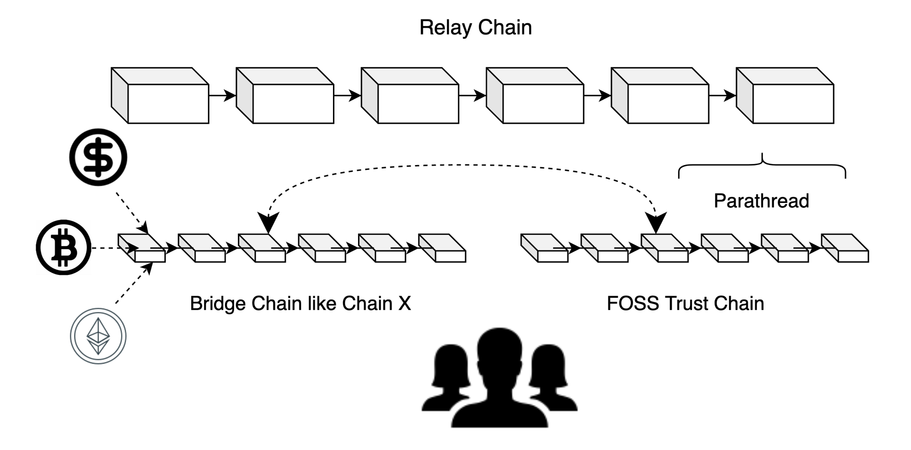
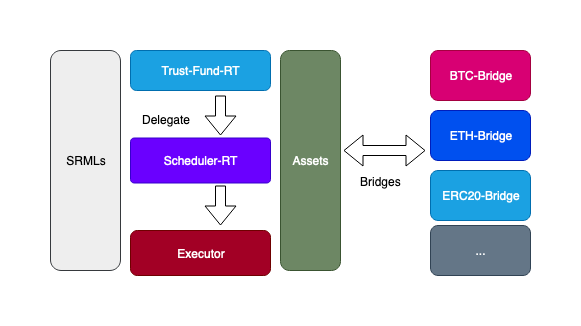
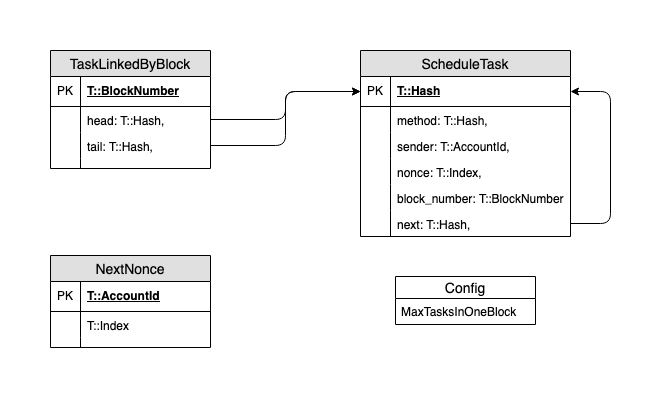

# FOSS Chain Node

## FOSS Trust UI
[here](https://github.com/polkaworld-org/Hackathone-FOSS-trust-ui)

## RTML




### trust-fund
Main runtime module of FOSS Trust. Allow user manage trust fund.

### Scheduler
Allow other rtml delegate Calls to it, delay to execute or keep running at fixed interval.

Hack Executor to disguise the origin of calls.



### Assets
Change transfer to pub, so trust-fund can do schedule payment and execute grantor's testamentary.

## Additional Types
```
{
  BeneficiaryShare: {
    address: 'AccountId',
    weight: 'u64'
  },
  LivingSwitchCond: {
    _enum: {
      None: "Null",
      BlockHeight: "BlockNumber",
      Timestamp: "Moment",
      ClockInInterval: "BlockNumber"
    }
  }
}
```

## Roadmap
[here](ROADMAP.md)

## Build

Install Rust:

```bash
curl https://sh.rustup.rs -sSf | sh
```

Install required tools:

```bash
./scripts/init.sh
```

Build Wasm and native code:

```bash
cargo build
```


## Run

### Single node development chain

You can start a development chain with:

```bash
cargo run -- --dev
```

Detailed logs may be shown by running the node with the following environment variables set: `RUST_LOG=debug RUST_BACKTRACE=1 cargo run -- --dev`.

### Multi-node local testnet

If you want to see the multi-node consensus algorithm in action locally, then you can create a local testnet with two validator nodes for Alice and Bob, who are the initial authorities of the genesis chain that have been endowed with testnet units.

Optionally, give each node a name and expose them so they are listed on the Polkadot [telemetry site](https://telemetry.polkadot.io/#/Local%20Testnet).

You'll need two terminal windows open.

We'll start Alice's substrate node first on default TCP port 30333 with her chain database stored locally at `/tmp/alice`. The bootnode ID of her node is `QmRpheLN4JWdAnY7HGJfWFNbfkQCb6tFf4vvA6hgjMZKrR`, which is generated from the `--node-key` value that we specify below:

```bash
cargo run -- \
  --base-path /tmp/alice \
  --chain=local \
  --alice \
  --node-key 0000000000000000000000000000000000000000000000000000000000000001 \
  --telemetry-url ws://telemetry.polkadot.io:1024 \
  --validator
```

In the second terminal, we'll start Bob's substrate node on a different TCP port of 30334, and with his chain database stored locally at `/tmp/bob`. We'll specify a value for the `--bootnodes` option that will connect his node to Alice's bootnode ID on TCP port 30333:

```bash
cargo run -- \
  --base-path /tmp/bob \
  --bootnodes /ip4/127.0.0.1/tcp/30333/p2p/QmRpheLN4JWdAnY7HGJfWFNbfkQCb6tFf4vvA6hgjMZKrR \
  --chain=local \
  --bob \
  --port 30334 \
  --telemetry-url ws://telemetry.polkadot.io:1024 \
  --validator
```

Additional CLI usage options are available and may be shown by running `cargo run -- --help`.
